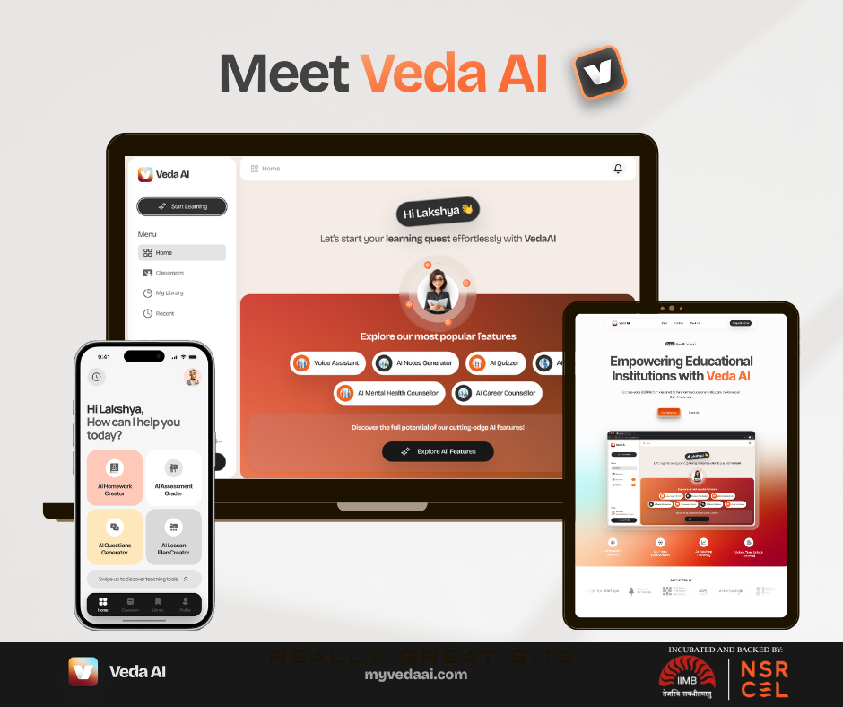

# VedaAI Documentation

<div align="center">
  
  <p><em>Where Education Meets Innovation</em></p>
  <a href="mailto:lakshya@myvedaai.com"></a>
  <br>
  
  
  
</div>

---

## 🌐 Accessing VedaAI

- **Platform Website:** [https://www.myvedaai.com/](https://www.myvedaai.com/)
- **Learning Dashboard:** [https://learn.myvedaai.com/](https://learn.myvedaai.com/)  
  (Teacher and student login portal)

### Demo Credentials

| Role     | Email                | Password           |
|----------|----------------------|--------------------|
| Teacher  | (will be available soon) | (will be available soon) |
| Student  | (will be available soon) | (will be available soon) |

<sub>Demo credentials will be provided for evaluation and demonstration purposes. Please check back or contact us for access.</sub>

### Source Code Access

The backend and frontend repositories for VedaAI are not publicly available due to security and privacy requirements of our partner institutions. This documentation repository provides a comprehensive technical overview and architecture insights.

---


## 🚀 What is VedaAI?

**VedaAI** is a next-generation B2B SaaS platform designed to empower schools and educational institutions by harnessing the transformative potential of artificial intelligence. Built for real-world deployment, it combines advanced AI capabilities, real-time collaboration, and robust analytics to deliver a modern, scalable, and secure learning experience.

Our mission is to increase teacher productivity, save valuable time, and enhance student learning outcomes through a comprehensive suite of AI tools tailored specifically for educational institutions. With customizable, white-labeled solutions, VedaAI enables schools to stay ahead in the technology race while enhancing their reputation and educational excellence.

Our ultimate vision is to empower over 100,000+ schools across India and abroad, becoming a globally recognized leader in AI-driven education technology and a transformative force in the industry.

### 🌟 Key Points

- **Multi-Institutional, Production-Ready**: Deployed in live educational environments, built for scale and reliability.
- **AI at the Core**: Multi-provider LLM support (OpenAI, Claude, AWS Bedrock, custom models) for grading, content generation, and more.
- **Real-Time Collaboration**: WebSocket-powered live classes, chat, and collaborative tools.
- **Customizable & White-Label**: Institution-specific branding, flexible workflows, and feature toggles.
- **Enterprise Security**: GDPR/FERPA compliance, encrypted data, and robust access controls.
- **Modern Tech Stack**: React, TypeScript, Node.js/Python, Redis, MongoDB, and more.
- **Intelligent Analytics**: AI-driven dashboards, predictive insights, and custom reporting.

---


## 🏗️ Architecture & Documentation

VedaAI is engineered with a modular, scalable architecture for both frontend and backend. Explore detailed technical documentation:

- **Frontend:** [architecture/FRONTEND_README.md](./architecture/FRONTEND_README.md) — Modern React, real-time features, advanced UI/UX, and state management.
- **Backend:** [architecture/BACKEND_README.md](./architecture/BACKEND_README.md) — Modular Node.js/Python, multi-channel WebSocket, AI/LLM integration, and enterprise security.
- **(See [architecture/README.md](./architecture/README.md) for structure overview.)**

<details>
<summary><strong>Directory Structure</strong></summary>

```text
architecture/
├── FRONTEND_README.md   # Frontend architecture and patterns
├── BACKEND_README.md    # Backend systems and API design
├── README.md            # Architecture structure overview
```
</details>

---


## ✨ Core Capabilities

- **AI-Powered Tools**: Homework generator, AI grading, smart content processing, and auto thread titling.
- **Real-Time Collaboration**: Multi-channel WebSockets, live classrooms, collaborative workspaces, and instant notifications.
- **Customization**: White-label solutions, flexible LLM integration, role-based interfaces, and configurable workflows.
- **Analytics**: Learning dashboards, predictive insights, progress visualization, and custom reporting.

---


## 🛠️ Technology Stack (at a glance)

- **Frontend:** React 18+, TypeScript, styled-components, WebSocket, advanced state management
- **Backend:** Node.js/Python, Express, MongoDB, Redis, AWS S3, pluggable LLMs
- **AI/ML:** Multi-provider LLM support, custom model integration, async background processing

---


## 🎓 Why VedaAI?

- **Personalized Learning**: AI-adapted content for every student
- **Teacher Productivity**: Automated grading and content generation
- **Student Engagement**: Interactive, gamified, and collaborative experiences
- **Data-Driven**: Analytics for better decisions and outcomes
- **Scalable**: Architecture that grows with your institution

---


## 🔒 Security & Privacy

- **Data Privacy**: GDPR/FERPA compliant, encrypted data, audit trails
- **Authentication**: Multi-factor, role-based access
- **Monitoring**: Real-time system health and audit logging

---


## 📈 Production & Deployment

- **Live Deployments**: Serving real institutions with 99.9% uptime
- **Scalable Infrastructure**: Auto-scaling, performance monitoring, CI/CD

---


## 📚 Explore the Docs

- [Frontend Architecture](./architecture/FRONTEND_README.md)
- [Backend Architecture](./architecture/BACKEND_README.md)
- [Architecture Structure](./architecture/README.md)

---


## 🤝 Professional Context

This repository is a technical showcase for VedaAI. Source code is private due to live deployments and confidentiality, but the documentation covers:

- Architecture and design decisions
- Implementation strategies and best practices
- Scalability and performance
- Real-world deployment insights

For technical discussions or collaboration, contact: [lakshya@myvedaai.com](mailto:lakshya@myvedaai.com)

---

<div align="center">
  <strong>VedaAI — Transforming Education with Intelligent Technology</strong><br>
  <em>For more, see architecture docs or contact lakshya@myvedaai.com</em>
</div>